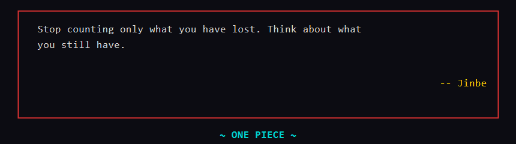

# Scripts

A collection of personal PowerShell/Bash utility scripts for Windows — plus a One Piece terminal fortune that greets you every time you open a shell.

---

## One Piece Terminal Fortune

Every time you open a terminal, a random quote from One Piece is shown in a styled box.



Two versions are included — one for Windows PowerShell, one for Bash (WSL / Linux / macOS):

| File | Shell | When to use |
|---|---|---|
| `onepiece-fortune.ps1` | PowerShell 5.1 (Windows) | Windows Terminal, VS Code terminal, any PowerShell prompt |
| `onepiece-fortune.sh` | Bash | WSL, Git Bash, Linux, macOS |

**PowerShell setup** — add this line to your `$PROFILE`:
```powershell
& "$HOME\onepiece-fortune.ps1"
```

**Bash setup** — add this line to your `~/.bashrc` or `~/.zshrc`:
```bash
source ~/onepiece-fortune.sh
```

Features:
- 200+ quotes spanning the entire series
- Characters include Luffy, Zoro, Sanji, Robin, Whitebeard, Roger, Law, Jinbe, and many more
- Red border box, yellow character attribution, cyan `~ ONE PIECE ~` footer
- One random quote per terminal open

---

## Scripts

### DevDiary.ps1

Your personal work black box. Run it at the end of each day to automatically log your activity.

**What it records automatically:**
- Meetings from Outlook calendar (today)
- Teams calls accepted today (from local MSTeams logs)
- Git activity from your project folder
- "What I Did" auto-filled from today's commit messages
- Active dev servers (ports 3000–10000)

**What it asks you:**
- Commit any dirty repos? (if uncommitted changes exist)
- Any wins today?
- Any blockers?
- What's first tomorrow?

**Output:**
- `Documents\DevDiary\daily\YYYY-MM-DD.md` — full daily entry
- `Documents\DevDiary\DevDiary.xlsx` — one row per day spreadsheet
- `Documents\DevDiary\dashboard.html` — visual HTML overview

**Usage:**
```powershell
.\DevDiary.ps1              # log today (interactive)
.\DevDiary.ps1 -Week        # view last 7 days summary
.\DevDiary.ps1 -Search "auth"  # search all days for a keyword
.\DevDiary.ps1 -ShowToday   # view today's entry (no prompts)
```

---

### Kill-Port.ps1

Find what is using a port and kill it. Supports TCP and UDP.

**What it does:**
- Finds processes listening on the given port (TCP + UDP)
- Shows process name, PID, and full executable path
- Recognises common dev servers (Angular, React, Vite, Next.js, NestJS, etc.)
- Asks for confirmation before killing
- Supports killing multiple processes on the same port

**Usage:**
```powershell
.\Kill-Port.ps1              # interactive: prompts for a port
.\Kill-Port.ps1 -Port 3000   # directly target port 3000
.\Kill-Port.ps1 -List        # show all listening ports (no kill)
```

---

### Organize-Downloads.ps1

Cleans up your Downloads folder by grouping old files into broad category folders.

**What it does:**
- **Consolidates** existing extension-named folders (PNG, SVG, PHP, SQL, ZIP, etc.) into broad categories — e.g. `PNG\` and `SVG\` merge into `Images\`, `PHP\` and `TS\` into `Code\`, `ZIP\` into `Archives\`
- Moves files older than 30 days into category folders: `Images`, `Videos`, `Audio`, `Documents`, `Archives`, `Code`, `Executables`, `Data`
- Moves old subfolders into a `Folders\` subfolder
- Files with unusual/no extensions go into `Others\`
- Handles duplicate filename conflicts automatically

**Category mapping:**
| Folder | Extensions |
|---|---|
| Images | jpg, jpeg, png, gif, bmp, webp, svg, ico, tiff, avif, heic, raw, … |
| Videos | mp4, mkv, avi, mov, wmv, flv, webm, … |
| Audio | mp3, m4a, wav, ogg, flac, aac, wma, opus |
| Documents | pdf, docx, xlsx, pptx, txt, md, csv, epub, one, … |
| Archives | zip, rar, tar, gz, 7z, iso, … |
| Code | py, js, ts, css, html, php, java, sql, json, yaml, ps1, bat, sh, … |
| Executables | exe, msi, vsix, apk, rdp, dll |
| Data | db, sqlite, log, eml, ics, jar, torrent |

**Usage:**
```powershell
.\Organize-Downloads.ps1          # run manually (any day)
.\Organize-Downloads.ps1 -Force   # bypass the monthly schedule guard
```

**Scheduling:**
Set up a daily Task Scheduler trigger — the script runs its full logic only on the **first Monday on or after the 1st** of each month, so it never lands on a weekend.

---

### onepiece-fortune.ps1

Random One Piece quote displayed every time you open a PowerShell terminal. See the [One Piece Terminal Fortune](#one-piece-terminal-fortune) section at the top for setup instructions.

---

### onepiece-fortune.sh

Same as above but for Bash (WSL / Linux / macOS). Source it from `~/.bashrc` or `~/.zshrc`.

---

## Requirements

- Windows 10/11
- PowerShell 5.1 or later
- For `DevDiary.ps1`: Microsoft Outlook and Microsoft Excel installed (for calendar/spreadsheet features)
- For `onepiece-fortune.sh`: Bash (WSL, Git Bash, Linux, or macOS)
